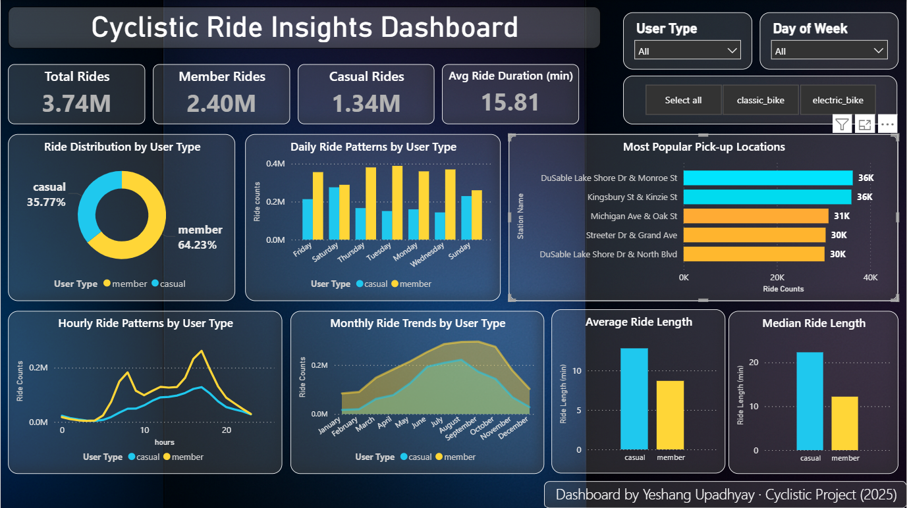
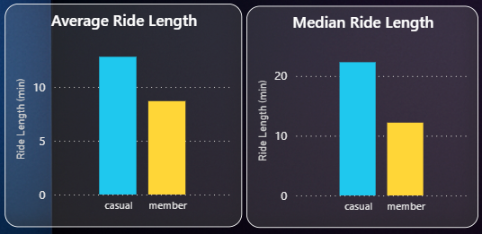
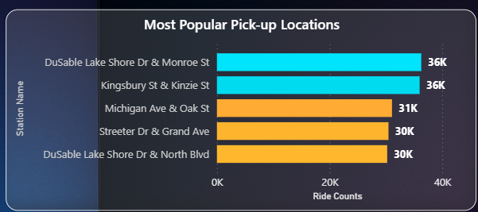
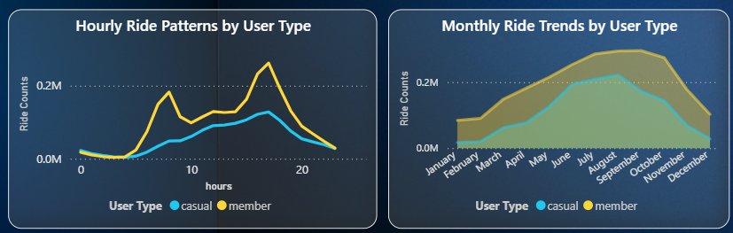

# Cyclistic Bike Share Analysis (DuckDB + Power BI)

High-performance analysis of Divvy bike-share data (~3.7M records) using DuckDB SQL for large-scale querying and Power BI for interactive visualization.

---

## 📌 Project Overview
This project analyzes large-scale bike-share data to understand user behavior, ride patterns, and operational trends.  
Unlike traditional Pandas workflows, DuckDB is used for efficient SQL-based processing of millions of records.

---

## 📂 Dataset
- Cleaned Dataset (Kaggle):  
👉 https://www.kaggle.com/datasets/yeshangupadhyay/divvy-trips-clean-dataset-nov-2024-oct-2025  

---

## ⚙️ Tech Stack
- Python (Pandas)
- DuckDB SQL
- Power BI

---

##  Data Processing
- Merged 12 months of trip data (~5.5M records)
- Cleaned and filtered dataset (~3.7M valid records)
- Created features:
  - Ride Length (minutes)
  - Day of Week
  - Hour of Day

---

##  Key Insights

- Members contribute ~64% of total rides; casual users ~36%
- Casual users have longer ride durations (~22 min vs ~12 min)
- Peak usage time is **5 PM** for both user types
- Members ride more on weekdays (commuting behavior)
- Casual users peak on weekends (leisure usage)
- Demand increases in summer and drops in winter
- High-demand stations include:
  - DuSable Lake Shore Dr & Monroe St
  - Kingsbury St & Kinzie St

---

##  Dashboard

### Overview


### Ride Length Comparison


### Popular Stations


### Trends Analysis


---

##  Business Recommendations
- Convert casual users into members through targeted offers
- Optimize bike availability during peak hours (5 PM)
- Increase capacity at high-demand stations
- Focus on seasonal demand (summer optimization)

---

## 📁 Project Structure

```
cyclistic-bike-share-analysis/
├── dashboard/
│ ├── overview.png
│ ├── ride_length.png
│ ├── stations.png
│ └── trends.png
├── cyclistic_analysis.ipynb
└── README.md
```

##  Author
Yeshang Upadhyay
